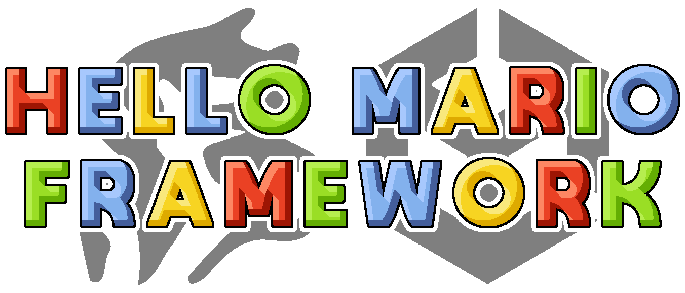

---
Create your own 3D Mario game with Hello Mario Framework for Unity! Zero programming experience needed! This open source Mario framework is feature packed with tons of items and enemies, and is bundled with open source level design tools that will let you easily create levels and build the 3D Mario game of your dreams!

# Getting Started

Hello Mario Framework is designed to be used with **Unity 2022.3 LTS**. After extracting the contents of Hello Mario Framework to a new folder, from within Unity Hub, click on Open > Add project from disk, then select the folder that contains Hello Mario Framework.

# License

The Hello Mario Framework is licensed under the MIT License. For your convenience, the following packages have been bundled with the framework. All of them are licensed under the MIT License. That means 100% of the code on this repository is MIT licensed!

* [RealtimeCSG](https://github.com/LogicalError/realtime-CSG-for-unity)
* [SimpleAnimation](https://github.com/Unity-Technologies/SimpleAnimation)
* [Unity Scene Reference](https://github.com/JohannesMP/unity-scene-reference)

The **Super Mario** models, textures, animations, and audio clips included with the framework are for free non-profit fan game projects only. If you intend to use Hello Mario Framework in a commercial project, you must replace all of these assets with your own!
